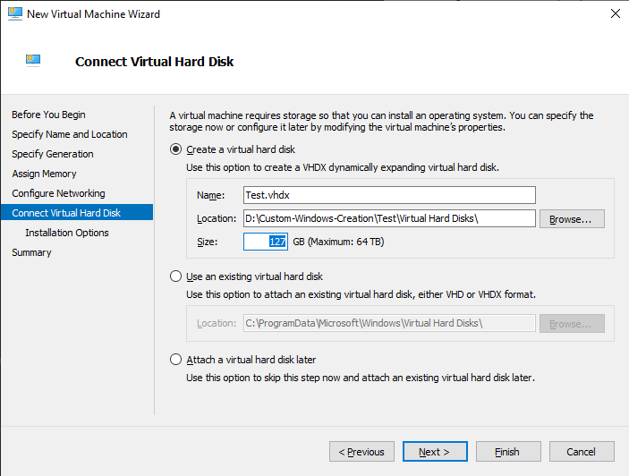

1. What is the purpose of this custom Windows image creation and what are required
2. Step-by-step guide for creating images with MDT
3. Creating and customizing images with unnattend.xml-files
4. What we found and what to look out for
5. Custom windows installation will allow you to add and delete software, applications and drivers to your personalized operating system.

---

Software needed to create Microsoft Windows custom images:

-WinPE (Due to compatibility issues older version of WinPE was used in this project: https://go.microsoft.com/fwlink/?linkid=2120253 )

-WinADK
-MDT
-Virtual machine (Hyper-V was used in this example)
-x64 ISO image file ( Official Microsoft download link: https://www.microsoft.com/en-us/software-download/windows11 )

## 2. Step-by-step guide for creating images with MDT

Download Windows ADK (accesment and deployment kit)

- https://learn.microsoft.com/en-us/windows-hardware/get-started/adk-install

WinPE add-on(Preinstallation environment) :

- https://learn.microsoft.com/en-us/windows-hardware/get-started/adk-install

(Under that previously mentioned link you'll find the latest version of winPE at the end of the article)

Windows operating system as an ISO-file

- https://www.microsoft.com/en-us/software-download/windows11

And Virtual machine of your choise

<details>
<summary>  Installation guide  </summary>

Open Deployment Workbench


Create Deployment Share


For completely automated process we recommend you uncheck every box here


After creating the Deployment Share we need to mount the Windows Operating system ISO-file


Mounted Image should appear as a DVD-drive


Let's go back to WorkBench and add this operating system to be customized


Choose "Full set of source files"


This Mounted operating system should appear under "This PC" as a DVD-drive


You can name this operating system whatever you want under the "Destination Directory Name", but automatically it will choose one of the available Windows operating systems randomly and name it after one of those.

On the "Summary"-view you should click "Finish" and let the "Import operating system wizard" finish the rest.

After adding your operating system your "Operating systems"-folder should have updated


Next we will add a "Task sequence"


Again you can name the file whatever you want, but the Task sequence ID should be something you can remember easily


We will be using "Standard Client Task Sequence" as template


Choose whatever Windows 11-operating system you want, except "Home"


We do not want to add a product key.


You can choose your own credentials here for the "User" and the "Organization"


Do not specify Admin Password


After "Summary" click "Next" and let Task Sequence Wizard finish the job. After this You should have a new task sequence in this list


We shall come back to this after adding applications to this custom image. In this example we are going to use Google Chrome installation bundle

https://support.google.com/chrome/a/answer/7650032?hl=en

After downloading the bundle, extract it from its compressed file and look for "installers"-folder. It should look like this and in this example we are going to use the "GoogleStandaloneEnterprise64.msi"-installer


Create a new folder for it and move this installer there


Go back to your WorkBench and add a new application


Choose "Application with source files"


Name the Application


Browse to the installer folder we previously created and give it here is a directory path


Check that the application name is correct in "destination"-page.
On the "Command details"-page write the following command to install this software silently:

`msiexec /l GoogleChromeStandaloneEnterprise64.msi /qn`


Check that everything seems correct on "Summary"-page and click "Next". Let application wizard finish the job and now you should have an application in the "applications"-folder of WorkBench


In this "applications"-folder you can also check your applications properties, by right-clicking the application and adjust things like command line as well as on which platforms this app should run on.


Let's go back to "Task Sequences"-folder and check your task sequences properties


## Task Sequences

Task sequence is a set of actions excuted in a linear order.

#### Create a new Task Sequence.

1. 

- Input task ID sequence ID
- Input task seqence name
- input sequence comments(if any)
- Select the next icon

2. 

- Select the Standard Client Task Sequence template.
- select the next icon

3. 

- Select the needed opearting system.
- select the next icon

4. 

- Specify a product key if applicable, for this task we opted for the **do not specify product key at this time** option.

5. 

- Specify OS settings.
  - Add the Full name
  - Add your Organization
  - Add default browser page.
- Select the next icon

6. 

- Specify the local admin password for the task sequence if applicable.
- Select the next icon

7. 

- Confirm your selections in the summary
- Select the next icon
- Select the finish icon

8. 

- Select the created task sequence and navigate to the properties page.
- Leave the general tab on the default settings page

**NOTE:** IF you have many task sequences you can disable the one that is not needed by toggling **the Enable this task sequence option**.

- Select the task sequence tab

9. 

- On the task sequence page, you can toogle between each steps to activate or de-activate certain tasks.
- Expand the state restore option and select the windows update (pre-application installation), navigate to the options menu and tick the **Disable this step** option and apply changes
- Select the windows update (post-application installation), navigate to the options menu and tick the **Disable this step** option and apply changes.
- Select the OK icon.

</details>

<details>
<summary> Testing image in Virtual machine </summary>

This guide will tell you about setting up the image in virtual environment. We used Hyper-V manager as the Virtual machine, since it has kernel level access to host device and it was provided by Microsoft.

The ISO-image used in this example was previously built and renamed, but you'll learn where you can find the ISO-image you just created.

After Updating your deployment share, you should have this x64-iso image here in "Boot"-folder of your deployment share.


Open your Virtual Machine manager, and start the installation process, by creating a new virtual machine. Screenshot taken in Hyper-V manager.


Give your Virtual Machine a name, and choose a place to store it in your device


Choose which generation of Virtual machine you want


It is recommended to give atleast 2 megabytes of RAM to this device. In this tutorial I decided to give 4 MB of RAM


Here you can choose whether your device should have internet connection or not. This can be changed later.


Here you can choose how much memory your virtual device will have. For our case, 127 GB is enough



This is the most important part, where we choose our operating system. This can be done later, but I'll add it here next.


After checking your summary click "Finish" and let virtual machine manager set up the environment.


Now, by connecting to your device you will see a "start"-button. By clicking that button you will start the set up for your own custom Windows 11 image, and in this virtual environment you can test, and check out the features that you have added.

</details>

## 3. Creating and customizing images with unnattend.xml-files

### Tools

Windows Assessment and Deployment Kit ([ADK](https://learn.microsoft.com/en-us/windows-hardware/get-started/))

Windows Preinstallation Environment ([WinPE](https://learn.microsoft.com/en-us/windows-hardware/manufacture/desktop/winpe-intro?view=windows-11))

### Working with Answer files

Note: Example of autounattend.xml is added to this repository.

### Windows System Image Manager (SIM)

SIM helps with creation of Answer files (unattend.xml) that can be used to modify the Windows installation.

### Extract the official ISO

1. First thing first download the Windows ISO. [LINK](https://www.microsoft.com/software-download/windows11)
2. Extract ISO contents to some folder

### Automate windows setup

[microsoft docs: Automate Windows Setup](https://learn.microsoft.com/en-us/windows-hardware/manufacture/desktop/automate-windows-setup?view=windows-11)

[microsoft docs: Automate OOBE](https://learn.microsoft.com/en-us/windows-hardware/customize/desktop/automate-oobe)

<details>
<summary>Disable TPM, Secure boot and RAM checks</summary>

```xml
<settings pass="windowsPE">
    <component name="Microsoft-Windows-Setup" ... >
        <RunSynchronous>
            <RunSynchronousCommand wcm:action="add">
                <Order>1</Order>
                <Path>reg add HKLM\SYSTEM\Setup\LabConfig /v BypassTPMCheck /t REG_DWORD /d 1 /f</Path>
            </RunSynchronousCommand>
            <RunSynchronousCommand wcm:action="add">
                <Order>2</Order>
                <Path>reg add HKLM\SYSTEM\Setup\LabConfig /v BypassSecureBootCheck /t REG_DWORD /d 1 /f</Path>
            </RunSynchronousCommand>
            <RunSynchronousCommand wcm:action="add">
                <Order>3</Order>
                <Path>reg add HKLM\SYSTEM\Setup\LabConfig /v BypassRAMCheck /t REG_DWORD /d 1 /f</Path>
            </RunSynchronousCommand>
        </RunSynchronous>
    </component>
</settings>
```

</details>

<details>
<summary>Microsoft-Windows-International-Core-WinPE</summary>

```xml
<settings pass="windowsPE">
    <component name="Microsoft-Windows-International-Core-WinPE" ... >
        <UILanguage>en-US</UILanguage>
        <SystemLocale>en-US</SystemLocale>
        <UserLocale>fi-FI</UserLocale>
        <InputLocale>fi-FI</InputLocale>
        <UILanguageFallback>en-US</UILanguageFallback>
    </component>
</settings>
```

</details>

<details>
<summary>Microsoft-Windows-Setup UserData ProductKey AcceptEula</summary>

```xml
<settings pass="windowsPE">
    <component name="Microsoft-Windows-Setup" ... >
        <UserData>
            <ProductKey>
                <!-- generic product key to automate choosing Windows PRO license  -->
                <Key>VK7JG-NPHTM-C97JM-9MPGT-3V66T</Key>
                <WillShowUI>OnError</WillShowUI>
            </ProductKey>
            <AcceptEula>true</AcceptEula>
        </UserData>
    </component>
</settings>
```

</details>

<details>
<summary>Microsoft-Windows-Setup ImageInstall OSImage InstallTo</summary>

```xml
<settings pass="windowsPE">
    <component name="Microsoft-Windows-Setup" ... >
        <ImageInstall>
            <OSImage>
                <InstallFrom>
                    <MetaData wcm:action="add">
                        <Key>/IMAGE/INDEX</Key>
                        <Value>6</Value>
                    </MetaData>
                </InstallFrom>
                <InstallTo>
                    <DiskID>0</DiskID>
                    <PartitionID>3</PartitionID>
                </InstallTo>
                <WillShowUI>OnError</WillShowUI>
            </OSImage>
        </ImageInstall>
        <DiskConfiguration>
            <Disk wcm:action="add">
                <DiskID>0</DiskID>
                <WillWipeDisk>true</WillWipeDisk>
                <CreatePartitions>
                    <CreatePartition wcm:action="add">
                        <Order>1</Order>
                        <Type>EFI</Type>
                        <Size>100</Size>
                    </CreatePartition>
                    <CreatePartition wcm:action="add">
                        <Order>2</Order>
                        <Type>MSR</Type>
                        <Size>128</Size>
                    </CreatePartition>
                    <CreatePartition wcm:action="add">
                        <Order>3</Order>
                        <Type>Primary</Type>
                        <Extend>true</Extend>
                    </CreatePartition>
                </CreatePartitions>
                <ModifyPartitions>
                    <ModifyPartition wcm:action="add">
                        <PartitionID>1</PartitionID>
                        <Order>1</Order>
                        <Label>System</Label>
                        <Format>FAT32</Format>
                    </ModifyPartition>
                    <ModifyPartition wcm:action="add">
                        <Order>2</Order>
                        <PartitionID>2</PartitionID>
                    </ModifyPartition>
                    <ModifyPartition wcm:action="add">
                        <Order>3</Order>
                        <PartitionID>3</PartitionID>
                        <Label>OS</Label>
                        <Letter>C</Letter>
                        <Format>NTFS</Format>
                    </ModifyPartition>
                </ModifyPartitions>
            </Disk>
        </DiskConfiguration>
    </component>
</settings>
```

</details>

<details>
<summary>Bypass Microsoft account requirement</summary>

```xml
<settings pass="specialize">
    <component name="Microsoft-Windows-Deployment" ... >
        <RunSynchronous>
            <RunSynchronousCommand wcm:action="add">
                <Order>1</Order>
                <Path>reg add HKLM\SOFTWARE\Microsoft\Windows\CurrentVersion\OOBE /v BypassNRO /t REG_DWORD /d 1 /f</Path>
            </RunSynchronousCommand>
        </RunSynchronous>
    </component>
</settings>
```

</details>

<details>
<summary>Microsoft-Windows-International-Core</summary>

```xml
<component name="Microsoft-Windows-International-Core-WinPE" ... >
    <UILanguage>fi-FI</UILanguage>
    <SystemLocale>fi-FI</SystemLocale>
    <UserLocale>fi-FI</UserLocale>
    <InputLocale>fi-FI</InputLocale>
    <UILanguageFallback>en-US</UILanguageFallback>
</component>
```

</details>

<details>
<summary>Microsoft-Windows-Shell-Setup/UserAccounts</summary>

```xml
<settings pass="oobeSystem">
    <component name="Microsoft-Windows-Shell-Setup" ...>
        <UserAccounts>
            <LocalAccounts>
                <LocalAccount wcm:action="add">
                    <Password>
                        <Value></Value>
                        <PlainText>true</PlainText>
                    </Password>
                    <Description>add local account</Description>
                    <DisplayName>user</DisplayName>
                    <Name>user</Name>
                    <Group>Administrators</Group>
                </LocalAccount>
            </LocalAccounts>
        </UserAccounts>
    </component>
</settings>
```

</details>

<details>
<summary>Microsoft-Windows-Shell-Setup/OOBE</summary>

```xml
<settings pass="oobeSystem">
    <component name="Microsoft-Windows-Shell-Setup" ... >
        <OOBE>
            <HideEULAPage>true</HideEULAPage>
            <HideOEMRegistrationScreen>true</HideOEMRegistrationScreen>
            <HideOnlineAccountScreens>true</HideOnlineAccountScreens>
            <HideWirelessSetupInOOBE>true</HideWirelessSetupInOOBE>
            <HideLocalAccountScreen>true</HideLocalAccountScreen>
            <ProtectYourPC>3</ProtectYourPC>
        </OOBE>
    </component>
</settings>
```

</details>

<details>
<summary>Microsoft-Windows-Shell-Setup/AutoLogon</summary>

```xml
<settings pass="oobeSystem">
    <component name="Microsoft-Windows-Shell-Setup" ... >
        <AutoLogon>
            <Username>user</Username>
            <Enabled>true</Enabled>
        </AutoLogon>
    </component>
</settings>
```

</details>

### Disable automatic updates

<details>
<summary>unattended.xml</summary>

```xml
<settings pass="oobeSystem">
    <component name="Microsoft-Windows-Shell-Setup" ... >
        <FirstLogonCommands>
            <SynchronousCommand wcm:action="add">
                <Description>disable automated updates</Description>
                <Order>2</Order>
                <RequiresUserInput>false</RequiresUserInput>
                <CommandLine>reg add HKLM\SOFTWARE\Policies\Microsoft\Windows\WindowsUpdate\AU /v NoAutoUpdate /t REG_DWORD /d 1 /f</CommandLine>
            </SynchronousCommand>
        </FirstLogonCommands>
    </component>
</settings>
```

</details>

### Install 3rd party apps

Applications can be added to the ISO, after which they can be executed with unattended file.

1. Create directory for your applications in the extracted ISO contents directory
   ```ps
   MkDir c:\pathto\apps
   ```
2. Add your 3rd party application .EXE or .MSI installers to that directory
3. Use unattended to run the application installer in silent mode

   <details>
   <summary>unattended.xml</summary>

   ```xml
   <settings pass="oobeSystem">
       <component name="Microsoft-Windows-Shell-Setup" ... >
           <FirstLogonCommands>
               <SynchronousCommand wcm:action="add">
                   <Description>install Firefox</Description>
                   <Order>1</Order>
                   <RequiresUserInput>false</RequiresUserInput>
                   <CommandLine>D:\apps\FirefoxSetup124.0.2.exe /S</CommandLine>
               </SynchronousCommand>
           </FirstLogonCommands>
       </component>
   </settings>
   ```

   </details>

### Removing Preinstalled Applications

#### Option 1: Powershell during OOBE with unattended

during OOBE you can use PowerShell with unattended file to remove applications.

<details>
<summary>unattended.xml</summary>

```xml
<settings pass="oobeSystem">
    <component name="Microsoft-Windows-Shell-Setup" ... >
            <SynchronousCommand wcm:action="add">
                <Description>remove clipchamp</Description>
                <Order>3</Order>
                <RequiresUserInput>false</RequiresUserInput>
                <CommandLine>powershell.exe Remove-AppxPackage Clipchamp.Clipchamp_2.2.8.0_neutral__yxz26nhyzhsrt</CommandLine>
            </SynchronousCommand>
        </FirstLogonCommands>
    </component>
</settings>
```

</details>

#### Option 2: Mounting Image with DISM

Alternatively, you can mount the image and remove applications with DISM.

1. Get index for desired Windows image:
   ```ps
   dism /get-imageinfo /ImageFile:"C:\pathto\sources\install.wim"
   ```
2. Create folder for where to mount the image:
   ```ps
   MkDir c:\mount
   ```
3. Mount windows image (index 6 for Pro image):
   ```ps
   dism /Mount-Image /ImageFile:"C:\pathto\sources\install.wim" /Index:6 /MountDir:"C:\mount"
   ```
4. List all applications in the mounted image:
   ```ps
   dism /Image:C:\mount /Get-ProvisionedAppxPackages
   ```
5. Remove unwanted applications:
   ```ps
   dism /Image:C:\mount /Remove-ProvisionedAppxPackage /PackageName:Clipchamp.Clipchamp_2.2.8.0_neutral_~_yxz26nhyzhsrt
   ```
6. Unmount the image and commit changes:
   ```ps
   dism /Unmount-Image /MountDir:"C:\mount" /Commit
   ```

These modifications are now baked into your install.wim

### Build the custom ISO with Oscdimg

Note: Needs to be ran in Deployment and Imaging Tools Environment

```ps
Oscdimg -m -o -u2 -udfver102 -bootdata:2#p0,e,b"C:\pathto\boot\etfsboot.com"#pEF,e,b"C:\pathto\efi\microsoft\boot\efisys.bin" "C:\pathto\" "C:\CustomWin11.iso"
```

## 4. What we learnt, errors and unused features

In this session you will learn about potential unused features and common errors you might encounter

- Server usability in this environment

  - It is possible to deploy this to a server which has workdomain, but it would defeat the goal of **silent** installation of software.

  

  - AD DS (Active directory domain services) This is a managing tool for computers, accounts and devices connected to this server and this allows the host server send updates and managed users visiting this server.
  - DHCP (Dynamic host configuration protocol) assigns IP addresses and network configuration. This also removes static IP-addresses making network management more efficient.
  - DNS (Domain name system) translates numerical IP-addresses into human readable domain names, which are most often seen on the internet with ".com"-ending. In this implementation I decided to create "domain.lan"-server which implies that this server will be used only in Local Area Network (LAN)
  - IIS (internet information services) will be able to connect your applications to internet and in this case I used it to host my local server and it made it easier for me to connect to it.
  - NPAS (Network policy access service) is a tool which manages authorization of users and with this you are able to set rules and roles to your users.
  - Remote desktop services (RDS) is a must when connecting from a regular machine/VM to a server and this also will give users remote desktop access to your server, if and when needed.

- Errors regarding setting up this environment

  - Powershell update required to use MDT Deployment workbench
  - code 80040049: Value for attribute is not valid: language
    <details>
    <summary>Possible fixes</summary>

    - Check your Windows ADK version
    - You might have the wrong version of winPE add on
    </details>

  - code 0x80070490: Failed to run task sequence
    <details>
    <summary>Possible fixes</summary>

    - If you encounter this error, you should open terminal in your Virtual environment and clean the disk

      ```ps
       diskpart
      ```

      ```ps
       list disk
      ```

      ```ps
       select disk #*
      ```

      ```ps
       clean
      ```

    - \*the disk volume/name

    - If cleaning of the disk didnt work you could also reformat the drives from your virtual machine.

      ```ps
          diskpart
      ```

      ```ps
      list volume
      ```

      ```ps
      select volume #*
      ```

      ```ps
      format fs=ntfs
      ```

      or

      ```ps
      format fs=ntfs quick
      ```

      if you want to force faster reformatting of this drive

    - \*the disk volume/name

    </details>

  - empty script error during launch

      <details>
    <summary>Possible fixes</summary>

    - You might have BitLocker protecting your iso-image
    - This error could also be from internet explorer like mentioned in the following article: https://learn.microsoft.com/en-us/mem/configmgr/mdt/known-issues
    - In this article they've mentioned this script that could fix the issue

    ```ps
    reg.exe add "HKLM\Software\Microsoft\Internet Explorer\Main" /t REG_DWORD /v JscriptReplacement /d 0 /f
    ```

    - You need to check your "Registery Editor" and assign new value to a file which is located in "HKEY_CLASSES_ROOT > .vbs ". There you can see a "(Default)"-String which by clicking it you are able to change its value to "VBSFile" and this error should be fixed

    </details>

- Windows Home edition isn't recommended
  - Windows 10 home is limited with its customization capabilities and it is also missing some key features that are present on other versions of Windows.
  - One of the biggest things missing from this operating system was Hyper-V Virtual machine support.
- Using Third-party software to create images

  - We've also explored the possibility to create images with not-Microsoft supported applications, mainly NTlite.
  - https://www.ntlite.com/

  <details>
    <summary>Screenshots of NTlite</summary>
    
   
    Selecting my operating system.

  

  Creating custom image.
  

  When Image is ready it gives this message.

  

  Next we will add our 3rd party software

  

  We will disable windows autoupdates and gaming features

  

  Removing Windows preinstalled applications. In this example I've disabled Windows Media Player and other Windows applications.

  

  This is what it looks like when I boot this image up, and as you can see there are couple of applications added to this desktop.

  

  </details>

  - This software made creating custom images much more simplistic with their drag-and-drop app installation and we could also just disable Windows own pre-installed applications
